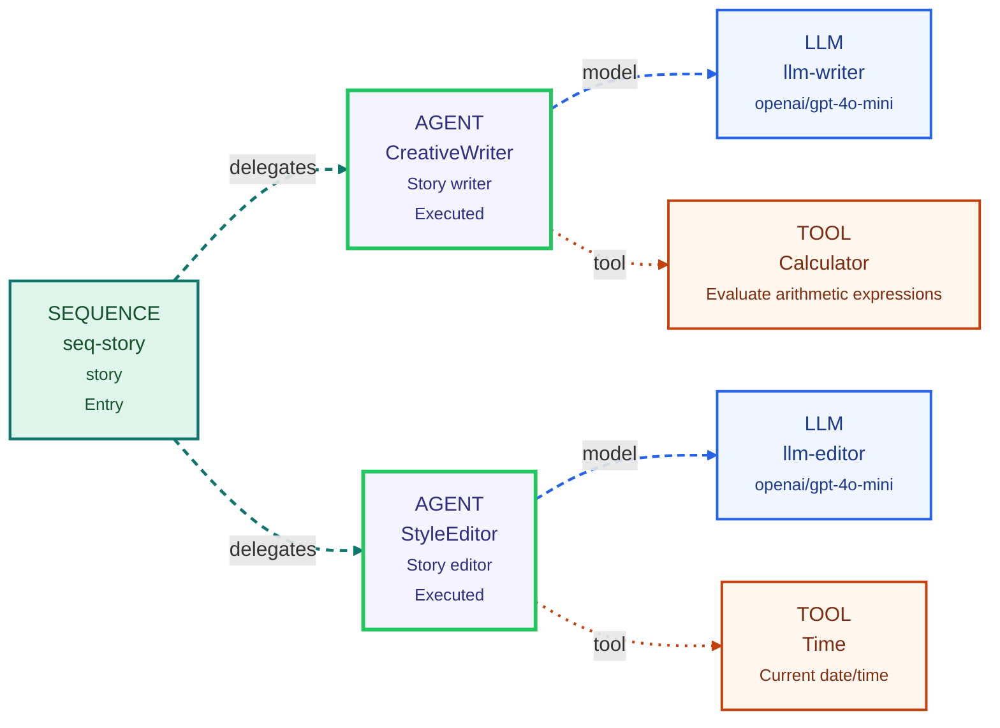

# Agent UI Editor

Visual editor for building and running agent workflows (LLM, Agent, Sequence, Parallel, Conditional, Supervisor) with a Spring Boot backend and React frontend.

## Quick Start

```bash
# Build frontend + backend and run tests
./gradlew build

# Run backend (serves API + embedded frontend)
./gradlew :be:bootRun
```

- UI: http://localhost:8085
- API: http://localhost:8085/api/v1/
- Health: http://localhost:8085/api/v1/health

Default port is `8085` (see `be/src/main/resources/application.yml`).

## Key Features

- n8n-style workflow editor with node palette and graph canvas.
- Auto layout with an orchestrator spine (entry on left, primary flow to the right) and attached dependency rows under each node (for LLM/router links).
- Tool assignments on agents are visualized as tool nodes connected to the owning sub-agent/supervisor.
- Visual connection semantics for orchestration edges (`delegates`, `model`, `router`, `tool`, `branch`).
- Node cards and palette now use dedicated icons/labels per type (`LLM`, `Agent`, `Supervisor`, `Sequence`, `Parallel`, `Conditional`).
- Left panel includes an `Agents` list for quick selection/focus on the canvas.
- UI rule: adding a new `Agent` or `Supervisor` auto-creates a paired dedicated `LLM` node and links it.
- Entry node is restricted to: `sequence`, `parallel`, or `supervisor`.
- LLM node setup supports `baseUrl`, `modelName`, `temperature`, and `maxTokens`.
- Workflow CRUD + run API.
- Example workflows are refreshed at backend startup (same sample names are updated in place).

## Visual Workflow Example



## Run Payload Format

Use `metadata` for run input. Example:

```json
{
  "metadata": {
    "prompt": "Write a short noir story about a robot in Paris.",
    "topic": "a robot in Paris",
    "style": "noir"
  }
}
```

The backend uses `metadata.prompt` as the primary prompt and treats other `metadata.*` keys as context.

`parallel` can be used as an entry node, but for clearer final responses prefer `sequence`/`supervisor` as entry and place `parallel` inside it, followed by a composing agent.

Run responses also include execution trace fields:

- `executedNodeIds`: node IDs that were executed (ordered, deduplicated).
- `executedNodeNames`: human-readable names for those executed nodes.

The editor uses this to highlight executed nodes after each run.

## Sub-Agent Prompt Configuration

For `agent` nodes (including sub-agents inside sequence/parallel/supervisor), you can now set:

- `role`: short role label for the agent.
- `systemMessage`: system instruction for that specific agent.
- `promptTemplate`: per-agent prompt template with placeholders (for example `{{metadata.prompt}}`, `{{metadata.topic}}`, `{{metadata.style}}`).

Template variables are resolved from the run input map. Recommended run input pattern:

```json
{
  "metadata": {
    "prompt": "Write a short noir story about a robot in Paris.",
    "topic": "a robot in Paris",
    "style": "noir"
  }
}
```

Example agent node:

```json
{
  "id": "writer",
  "type": "agent",
  "llmId": "llm-1",
  "name": "CreativeWriter",
  "role": "Story writer",
  "systemMessage": "You write concise, vivid first drafts.",
  "promptTemplate": "Write a short story about {{metadata.topic}} in {{metadata.style}} style.",
  "outputKey": "story"
}
```

## Project Docs

- [docs/agent-editor.md](docs/agent-editor.md): main user/developer guide.
- [docs/agent-editor-ui-guide.md](docs/agent-editor-ui-guide.md): detailed UI usage.

## Testing

```bash
# Backend tests (includes sample workflow integration coverage)
./gradlew :be:test

# Run only sample workflow integration test
./gradlew :be:test --tests '*SampleWorkflowsIntegrationTest'
```

## Security Notes

Do not commit passwords or API keys. Set secrets with environment variables (for example `OPENROUTER_API_KEY`).
